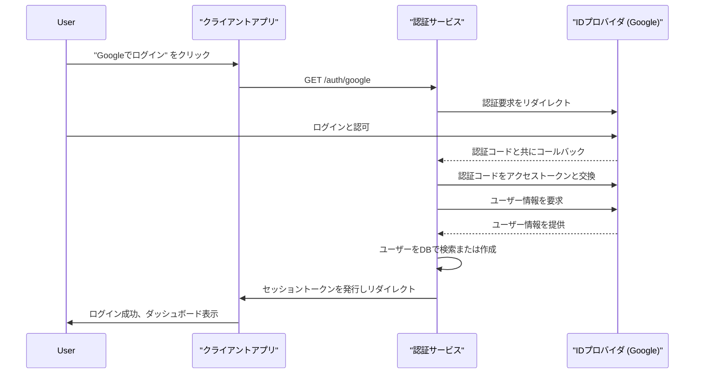
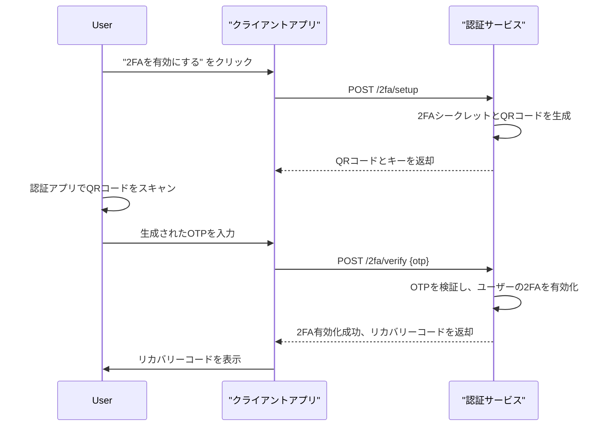

# 技術設計書

## 概要
本文書は、OAuth 2.0および2要素認証（2FA）を用いたユーザー認証機能の技術設計を定義します。本機能は、堅牢なセキュリティと優れたユーザーエクスペリエンスの両立を目指します。

### ゴール
- OAuth 2.0に対応したサードパーティプロバイダ（Google, GitHub）によるログイン機能の実装。
- TOTP（Time-based One-Time Password）アルゴリズムに基づく2FA機能の実装。
- 安全なアカウントリカバリー機能の提供。

### 対象外
- パスワードリセット機能。
- 複数サードパーティアカウントの単一ユーザーへの紐付け。

## アーキテクチャ

### ハイレベルアーキテクチャ
本機能は、Node.js/Expressで構築された認証サービスを中心とするマイクロサービスアーキテクチャを採用します。認証ロジックをカプセル化し、将来的な拡張性を確保します。

```mermaid
graph TD
    subgraph "クライアントアプリケーション"
        A[ログインページ]
    end

    subgraph "認証サービス"
        B[API Gateway]
        C[OAuthコントローラー]
        D[2FAコントローラー]
        E[ユーザーサービス]
        F[セッション管理]
    end

    subgraph "外部サービス"
        G[Google認証]
        H[GitHub認証]
    end

    subgraph "データストア"
        I[PostgreSQLデータベース]
    end

    A -->|1. ログイン要求| B
    B -->|2. ルーティング| C
    C -->|3. 認証リダイレクト| G
    G -->|4. 認証後コールバック| C
    C -->|5. ユーザー検証/作成| E
    E -->|6. データ永続化| I
    C -->|7. セッション発行| F
    F -->|8. 認証完了| A

    A -->|ログイン(2FA有効)| B
    B --> D
    D -->|OTP検証| E
    E --> I
    D --> F
```

### 技術スタックと設計判断

#### 技術スタック
- **言語/フレームワーク**: Node.js, Express.js
- **認証**: Passport.js (passport-google-oauth20, passport-github2)
- **2FA**: speakeasy (TOTPライブラリ)
- **データベース**: PostgreSQL
- **ORM**: Sequelize

#### 主要な設計判断
- **判断**: 認証ロジックを独立したマイクロサービスとして分離する。
- **背景**: 将来的に複数のクライアントアプリケーションから利用される可能性や、認証方法の追加・変更が容易になるため。
- **代替案**: モノリシックなアプリケーション内に認証機能を組み込む。
- **選択したアプローチ**: Express.jsを用いて認証専用のAPIサービスを構築する。
- **合理性**: 関心の分離を徹底し、メンテナンス性とスケーラビリティを向上させる。
- **トレードオフ**: サービス間通信のオーバーヘッドが発生するが、柔軟性がそれを上回る。

## システムフロー

### OAuth 2.0 ログインフロー


### 2FA 設定フロー


## コンポーネントとインターフェース

### `AuthService`
**責務**: 認証フロー全体を管理する。

#### `OAuthController`
**責務**: OAuth 2.0に関連するリクエストを処理する。
**APIコントラクト**:
| Method | Endpoint | Request | Response | Errors |
|---|---|---|---|---|
| GET | /auth/google | - | 302 Redirect | 500 |
| GET | /auth/google/callback | ?code=... | 302 Redirect | 401, 500 |

#### `TwoFactorAuthController`
**責務**: 2FAの設定、検証、無効化を処理する。
**APIコントラクト**:
| Method | Endpoint | Request | Response | Errors |
|---|---|---|---|---|
| POST | /2fa/setup | - | {qrCode, secret} | 401, 500 |
| POST | /2fa/verify | {otp} | {recoveryCodes} | 400, 401 |

#### `UserService`
**責務**: ユーザー情報の永続化と取得を管理する。
**インターフェース**:
```typescript
interface UserService {
  findOrCreateUser(profile: OAuthProfile): Promise<User>;
  enableTwoFactor(userId: string, secret: string): Promise<void>;
  validateTwoFactor(userId: string, otp: string): Promise<boolean>;
  getRecoveryCodes(userId: string): Promise<string[]>;
}
```

## データモデル

### 物理データモデル (PostgreSQL)

#### `users` テーブル
- `id`: UUID (Primary Key)
- `google_id`: VARCHAR
- `github_id`: VARCHAR
- `email`: VARCHAR (UNIQUE)
- `created_at`: TIMESTAMP
- `updated_at`: TIMESTAMP

#### `two_factor_auths` テーブル
- `user_id`: UUID (Foreign Key to users.id)
- `secret`: VARCHAR (Encrypted)
- `is_enabled`: BOOLEAN (default: false)
- `created_at`: TIMESTAMP
- `updated_at`: TIMESTAMP

#### `recovery_codes` テーブル
- `user_id`: UUID (Foreign Key to users.id)
- `code_hash`: VARCHAR (Hashed)
- `is_used`: BOOLEAN (default: false)

## エラーハンドリング
- **400 Bad Request**: OTPのフォーマットが不正な場合など。
- **401 Unauthorized**: 認証に失敗した場合。
- **422 Unprocessable Entity**: ビジネスロジックエラー（例: 無効なリカバリーコード）。
- **500 Internal Server Error**: データベース接続エラーなど、予期せぬサーバーエラー。

## テスト戦略
- **単体テスト**: `UserService`の各メソッド、`speakeasy`を利用したOTP生成・検証ロジック。
- **結合テスト**: Passport.jsのストラテジーと`UserService`の連携、APIエンドポイントごとの挙動。
- **E2Eテスト**: ユーザーがGoogleログインを行い、2FAを設定し、再度ログインするまでの一連のフロー。